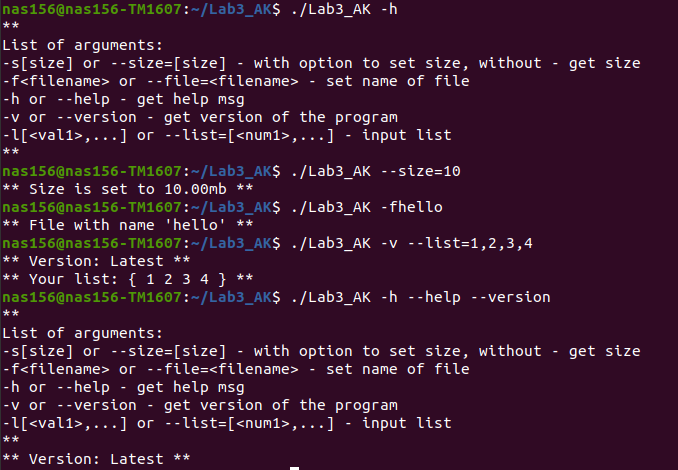

# AK2_LAB3

## Список аргументів:

List of arguments:  
-s[size] or --size=[size] - with option to set size, without - get size  
-f<filename> or --file=<filename> - set name of file  
-h or --help - get help msg  
-v or --version - get version of the program   
-l[<val1>,...] or --list=[<num1>,...] - input list 

## Результат виконання:

